# YamYam Pizzeria

Yam yam pizzeria is a favorite local pizza place. We make delicious pizzas with lots of tasty toppings, using fresh ingredients. If you love pizza, this is the place to go for a yummy, cheesy slice!

Users of this application will be able to create an account, login, check the menu and also book a table with the desired amount of persons in the suitable date and time.

## Table of Contents

----

## Design

----

### Flow Diagram

To structure and aid in creating the website, a basic flow diagram was created which is linked below.
[Flow Diagram](documentation/yamyam-diagram.pdf)

### Wirefremes

Please check below, a link to wireframes for the site layout.

[Wireframes](documentation/yamyam-wireframe.pdf)

### Colour Scheme

+ Three main colours were used in this website. The colours are:
  
    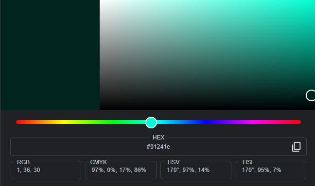
    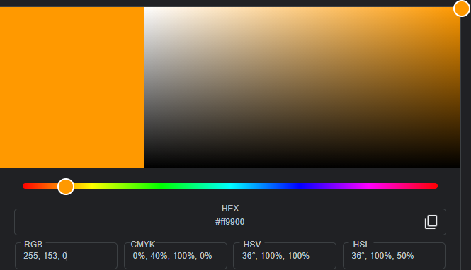
    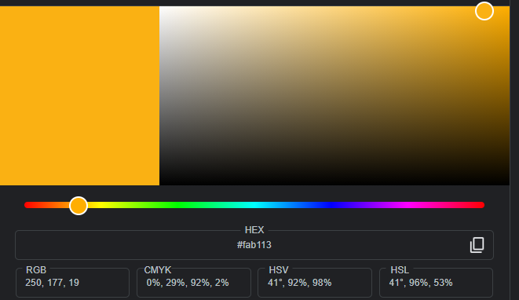

+ And two secondary colours were used for some "a tags", footer media when being hovered and the message that pops up when you foexample enter a wrong password. The colours are:

    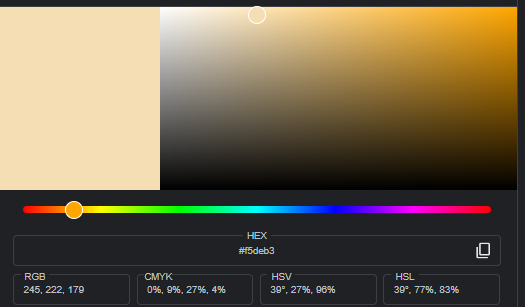
    

### Typography

To make this application seem like a pizzaeria, these two fonts were used:

+ The font [Dancing Script](https://fonts.google.com/?query=dancing+script) was applied to h1 and "Menu".
+ The standard bootstrap font

## Features

----

### Existing Features

+ #### The Header

  + Featured at the top of the page, the header shows the main headining of the website.
  + The navigation links are to the left:YamYam, Menu, Book_a_tabale, Register, and Login when the user is not logged in.
    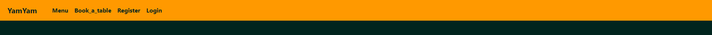
  + When the user is logged in, the navigations links become:YamYam, Menu, Book_a_table and Sign_out.
    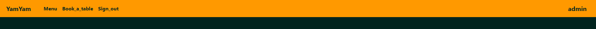

+ #### The Section
  
+ ##### Pizza Image

  + A big image of a pizza so that the costumer knows we only sell pizzas
    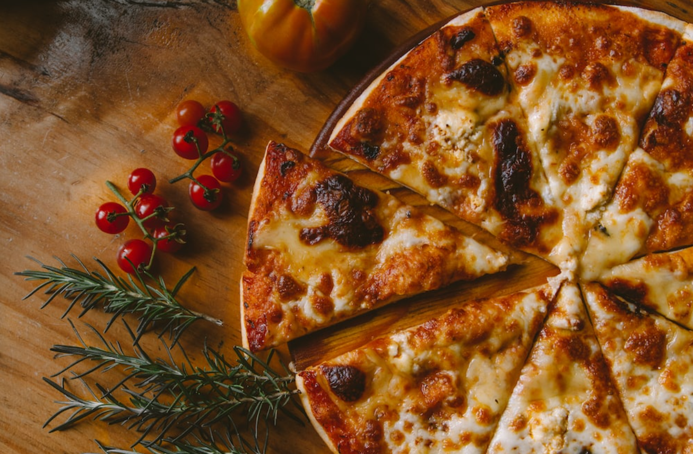

+ ##### Presentation

  + A paragraph to describe the pizzeria.
    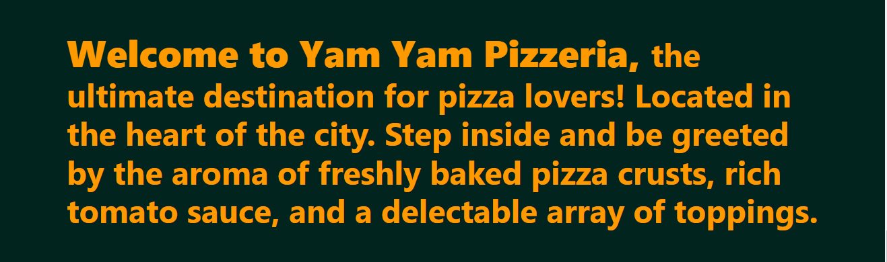

+ #### The Footer

  + The Footer has Yamyam's location, phone number and email
  + The Footer section als includes links to various social networks for Yamyam pizzeria.
  + It makes the user keep connected with us through social media.
    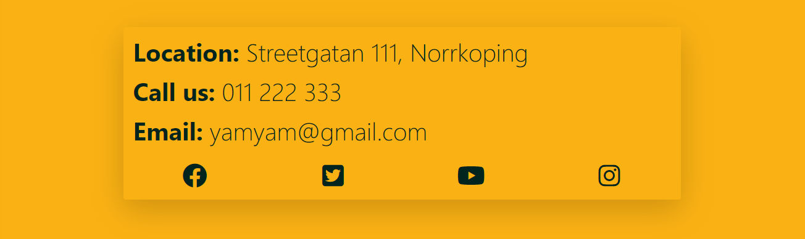

+ #### Menu Page

  + The Menu page basically shows all of pizzas we have.
    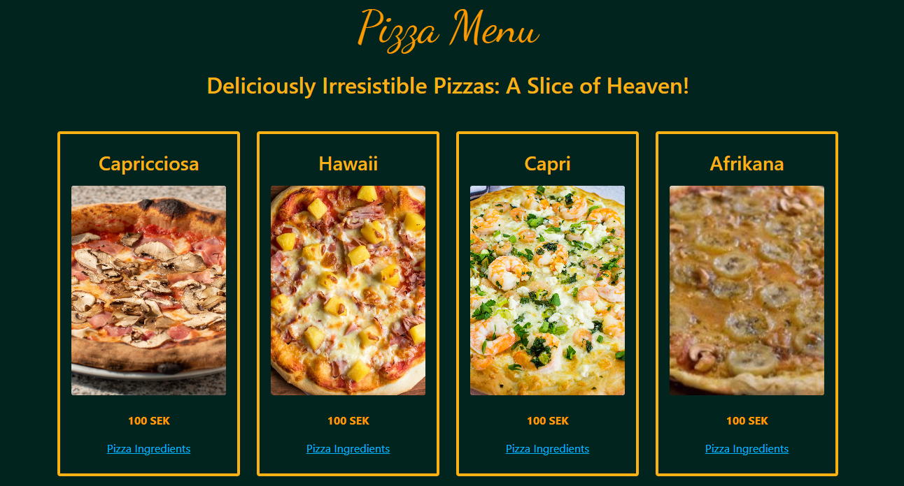
  + Each pizza card has a button to show the clicked pizza details
    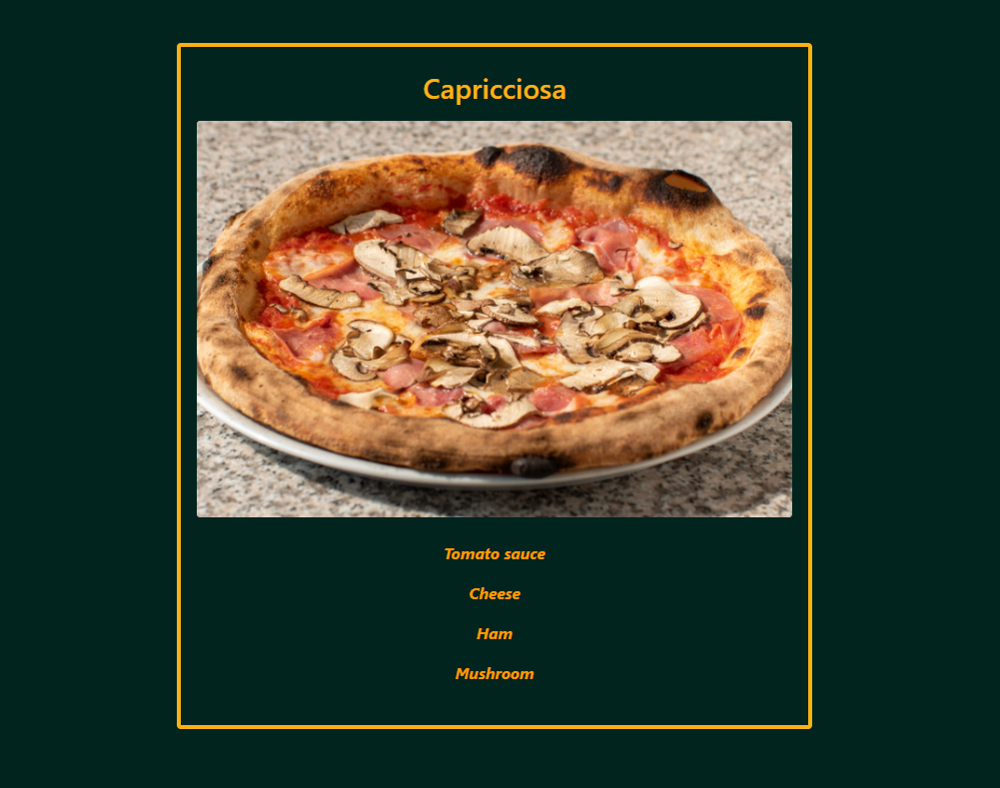

+ #### Register Page

  + Register page is mainly to create a new accoun.
  + If the user already has an account, the page offers a button to direct to login page
    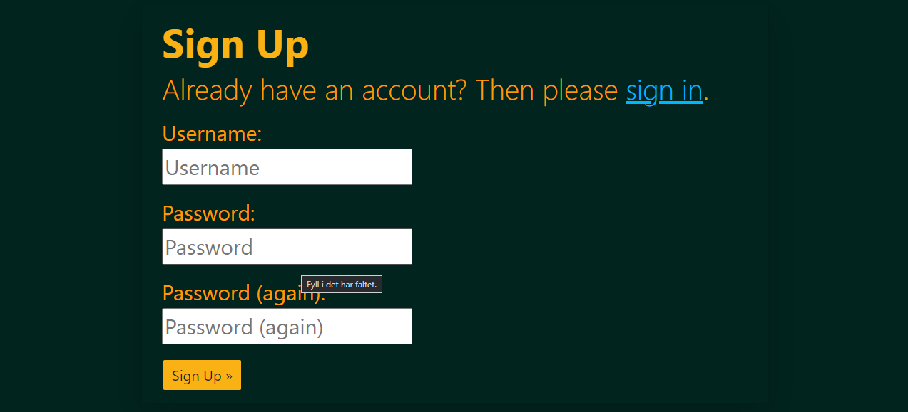

+ #### Login Page

  + Login page is mainly to log in.
  + If the user doesn't have an account, the page offers a button to direct to Register page
    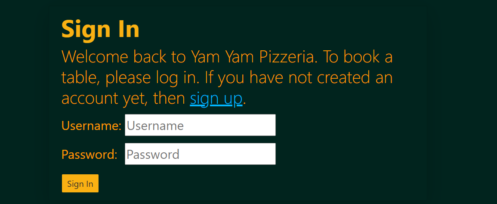

+ #### Book a Table Page

  + This page is to allow the user to book a table.
    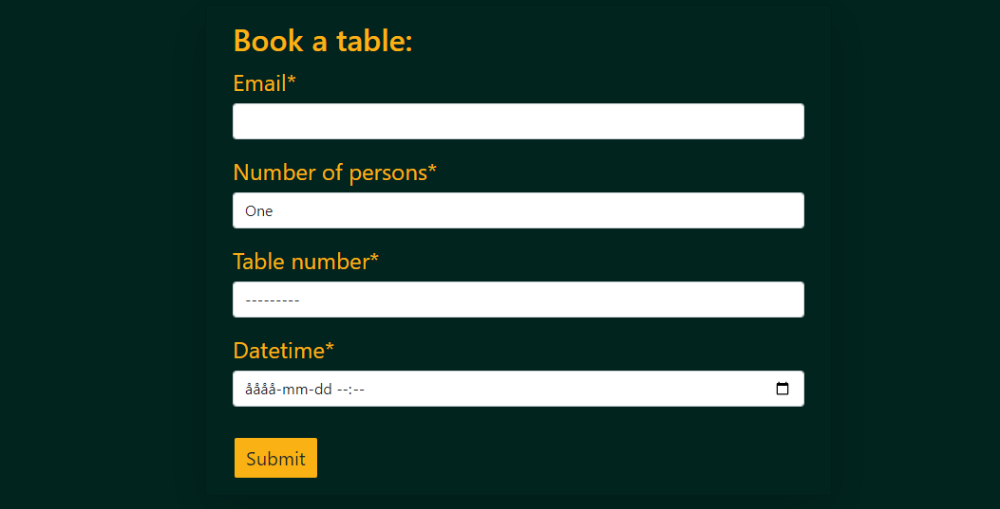
  + If the user hasn't logged in yet, they will be directed to "Login" page instead.
  + If the user has already booked a table, the page will show them the bookings they have.
    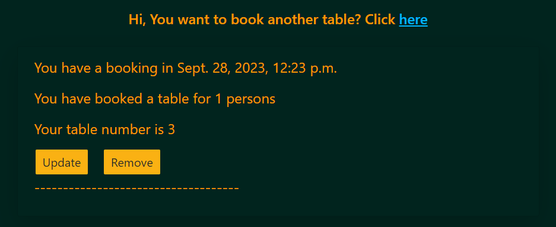
  + User can update any booking by clicking Update button.
    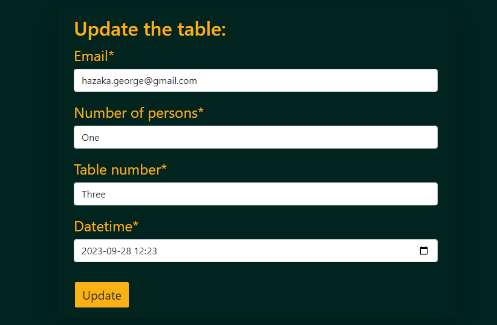
  + User can also cancel any booking by clicking Remove button.
    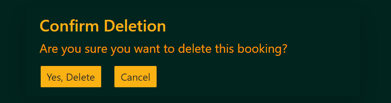

+ #### Sign Out

  + When clicked, the user will get signed out.

+ #### Navbar Toggler Button

  + It only appears when the user is using a device that has a width of 991 px or less.
    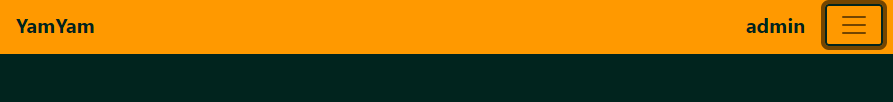
  + When clicked, the navbar is shown, clicked again and navbar disappears.
    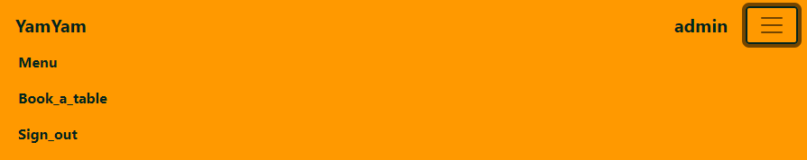

### Features Left To Implement

+ Create a menu for drinks.
+ Add a two button in the 'pizza_details.html' to go to the next and previous pizza without going back to the menu.
+ Add a google map to show the exact location of the pizzeria.

## User Experience

----

+ **User Story 001:** as a user I want to create an account.
  + **Tasks:** click on 'Register' button in the navbar, and fill the form, then click 'Sign Up' button located under the form.
+ **User Story 002:** as a user I want to log in to my account.
  + **Tasks:** click on 'Login' in the navbar, and fill the form, then click 'Sign In' button located under the form.
+ **User Story 003:** as a user I want to go th the Home page.
  + **Tasks:** click on 'YamYam' in the navbar.
+ **User Story 004:** as a user I want to check the menu.
  + **Tasks:** click on 'Menu' in the navbar.
+ **User Story 005:** as a user I want to see the pizza ingredients.
  + **Tasks:** after clicking on menu, you will see all the pizzas. Click the 'Pizza ingredients' button below any pizza and it will take you to another page where you can see all the pizza ingredients.
+ **User Story 006:** as a user I want to book a table.
  + **Tasks:** after logging in, click on 'Book_a_table' in the navbar and fill the form, then click 'Submit' located under the form.
+ **User Story 007:** as a user I want to see the tables I have already booked
  + **Tasks:** after logging in, click on 'Book_a_table' in the navbar. Or you can also click on your username located in the right side of the navbar.
+ **User Story 008:** as a user I want to book another table.
  + **Tasks:** after logging in, click on 'Book_a_table' in the navbar, the first paragraph is "Hi, You want to book another table? Click here". So click the word 'here'.
+ **User Story 009:** as a user I want to update a table that I have already booked
  + **Tasks:** after logging in, click on 'Book_a_table' in the navbar, you will see a list of all the bookings. Under every booking there is an 'Update' button. Click it, and it will take you to a page where you can fill the booking form. Fill that form and then click 'Update' located under the form.
+ **User Story 010:** as a user I want to cancel a table booking.
  + **Tasks:** after logging in, click on 'Book_a_table' in the navbar, you will see a list of all the bookings. Under every booking there is a 'Remove' button. Click it, and it will take you to a page where you have two buttons. Click the 'Yes, Delete' button.
+ **User Story 011:** as a user I want to sign out.
  + **Tasks:** after logging in, click on 'Sign_out' button in the navbar. A confirmation message will appear, click 'Yes'.
