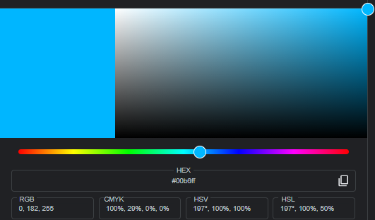
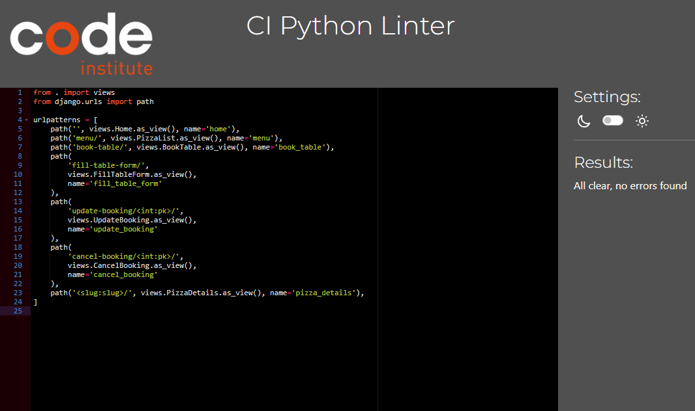

# YamYam Pizzeria

Yam yam pizzeria is a favorite local pizza place. We make delicious pizzas with lots of tasty toppings, using fresh ingredients. If you love pizza, this is the place to go for a yummy, cheesy slice!

Users of this application will be able to create an account, login, check the menu and also book a table with the desired amount of persons in the suitable date and time.


## Table of Contents

----

## Admin Credentials

+ username: admin
+ password: adminstator

## Design

----

### Flow Diagram

To structure and aid in creating the website, a basic flow diagram was created which is linked below.
[Flow Diagram](documentation/yamyam-diagram.pdf)

### Wirefremes

Please check below, a link to wireframes for the site layout.

[Wireframes](documentation/yamyam-wireframe.pdf)

### Colour Scheme

+ Three main colours were used in this website. The colours are:
  
    
    
    

+ And two secondary colours were used for some "a tags", footer media when being hovered and the message that pops up when you foexample enter a wrong password. The colours are:

    
    

### Typography

To make this application seem like a pizzaeria, these two fonts were used:

+ The font [Dancing Script](https://fonts.google.com/?query=dancing+script) was applied to h1 and "Menu".
+ The standard bootstrap font

## Features

----

### Existing Features

+ #### The Header

  + Featured at the top of the page, the header shows the main headining of the website.
  + The navigation links are to the left:YamYam, Menu, Book_a_tabale, Register, and Login when the user is not logged in.
    
  + When the user is logged in, the navigations links become:YamYam, Menu, Book_a_table and Sign_out.
    

+ #### The Section
  
+ ##### Pizza Image

  + A big image of a pizza so that the costumer knows we only sell pizzas
    

+ ##### Presentation

  + A paragraph to describe the pizzeria.
    

+ #### The Footer

  + The Footer has Yamyam's location, phone number and email
  + The Footer section als includes links to various social networks for Yamyam pizzeria.
  + It makes the user keep connected with us through social media.
    

+ #### Menu Page

  + The Menu page basically shows all of pizzas we have.
    
  + Each pizza card has a button to show the clicked pizza details
    

+ #### Register Page

  + Register page is mainly to create a new accoun.
  + If the user already has an account, the page offers a button to direct to login page
    

+ #### Login Page

  + Login page is mainly to log in.
  + If the user doesn't have an account, the page offers a button to direct to Register page
    

+ #### Book a Table Page

  + This page is to allow the user to book a table.
    
  + If the user hasn't logged in yet, they will be directed to "Login" page instead.
  + If the user has already booked a table, the page will show them the bookings they have.
    
  + User can update any booking by clicking Update button.
    
  + User can also cancel any booking by clicking Remove button.
    

+ #### Sign Out

  + When clicked, the user will get signed out.

+ #### Navbar Toggler Button

  + It only appears when the user is using a device that has a width of 991 px or less.
    
  + When clicked, the navbar is shown, clicked again and navbar disappears.
    

### Features Left To Implement

+ Create a menu for drinks.
+ Add a two button in the 'pizza_details.html' to go to the next and previous pizza without going back to the menu.
+ Add a google map to show the exact location of the pizzeria.

## User Experience

----

+ **User Story 001:** as a user I want to create an account.
  + **Tasks:** click on 'Register' button in the navbar, and fill the form, then click 'Sign Up' button located under the form.
+ **User Story 002:** as a user I want to log in to my account.
  + **Tasks:** click on 'Login' in the navbar, and fill the form, then click 'Sign In' button located under the form.
+ **User Story 003:** as a user I want to go th the Home page.
  + **Tasks:** click on 'YamYam' in the navbar.
+ **User Story 004:** as a user I want to check the menu.
  + **Tasks:** click on 'Menu' in the navbar.
+ **User Story 005:** as a user I want to see the pizza ingredients.
  + **Tasks:** after clicking on menu, you will see all the pizzas. Click the 'Pizza ingredients' button below any pizza and it will take you to another page where you can see all the pizza ingredients.
+ **User Story 006:** as a user I want to book a table.
  + **Tasks:** after logging in, click on 'Book_a_table' in the navbar and fill the form, then click 'Submit' located under the form.
+ **User Story 007:** as a user I want to see the tables I have already booked
  + **Tasks:** after logging in, click on 'Book_a_table' in the navbar. Or you can also click on your username located in the right side of the navbar.
+ **User Story 008:** as a user I want to book another table.
  + **Tasks:** after logging in, click on 'Book_a_table' in the navbar, the first paragraph is "Hi, You want to book another table? Click here". So click the word 'here'.
+ **User Story 009:** as a user I want to update a table that I have already booked
  + **Tasks:** after logging in, click on 'Book_a_table' in the navbar, you will see a list of all the bookings. Under every booking there is an 'Update' button. Click it, and it will take you to a page where you can fill the booking form. Fill that form and then click 'Update' located under the form.
+ **User Story 010:** as a user I want to cancel a table booking.
  + **Tasks:** after logging in, click on 'Book_a_table' in the navbar, you will see a list of all the bookings. Under every booking there is a 'Remove' button. Click it, and it will take you to a page where you have two buttons. Click the 'Yes, Delete' button.
+ **User Story 011:** as a user I want to sign out.
  + **Tasks:** after logging in, click on 'Sign_out' button in the navbar. A confirmation message will appear, click 'Ok'.

## Testing

----

+ I have tested that the site works in different browsers: Firefox, Brave, Chrome, Microsoft Edge.
+ I confirm that all inputs and buttons work properly.

### Manual Testing

+ #### Navbar Buttons Testing

    | Feature          | When The Following Is Done | Expect | Action | Result |
    | ---------------- | ------ | ------ | ------ | ------ |
    | **YamYam**      | YamYam button is clicked | Directs to Home page | Clicked YamYam button | Directed to Home page |
    | **Menu**        | Menu button is clicked | Directs to Menu page | Clicked Menu button | Directed to Menu page |
    | **Book_a_table**   | Book_a_table is clicked before logging in | Directs to Login page | Clicked Book_a_table button | Directed to Login page |
    | **Book_a_table**   | Book_a_table is clicked after logging in but there are no bookings | Directs to Book-table form page | Clicked Book_a_table button | Directsd to Book-table form page |
    | **Book_a_table**   | Book_a_table is clicked after logging in and there is at least one booking | Directs to Bookings-submitted page | Clicked Book_a_table button | Directed to Bookings-submitted page |
    | **Register** | Register button is clicked | Directs to Sign-up page | Clicked YamYam button | Directed to Sign-up page |
    | **Login** | Login button is clicked | Directs to Login page | Clicked Login button | Directed to Login page |
    | **Sign_out** | Sign_out button is clicked | Signs user out and redirects to Home page | Clicked Sign_out button | Signed user out and reirected to Home page |
    | **Username** | Username is clicked when there are no bookings | Directs to Book-table form page | Clicked Username | Directed to Book-table page |
    | **Username** | Username is clicked when there is at least one booking | Directs to Bookings-submitted page | Clicked Username | Directed to Bookings-submitted page |

+ #### Footer Media Testing

    | Feature       | When The Following Is Done | Expect | Action | Result |
    | ------------- | ------ | ------ | ------ | ------ |
    | **Facebook**  | Facebook button is clicked | Directs to Facebook page | Clicked Facebook button | Directed to Facebook page |
    | **Twitter**   | Twitter button is clicked | Directs to Twitter page | Clicked Twitter button | Directed to Twitter page |
    | **Youtube**   | Youtube button is clicked | Directs to Youtube page | Clicked Youtube button | Directed to Youtube page |
    | **Instagram**   | Instagram button is clicked | Directs to Instagram page | Clicked Instagram button | Directed to Instagram page |

+ #### Forms Testing

    | Feature          | When The Following Is Completed | Expect | Action | Result |
    | ---------------- | ------ | ------ | ------ | ------ |
    | **Sign Up**      | All fields are filled and Sign Up button is clicked | Creates account | Clicked Sign Up button | Account created |
    | **Login**        | All fields are filled and Sign In button is clicked | Logs in | Clicked Sign In button | Logged in |
    | **Book Table**   | All fields are filled and Submit button is clicked | Books the table | Clicked Submit button | Table booked |
    | **Update Table** | All fields are filled and Update button is clicked | Updates the table | Clicked Update button | Table updated |
    | **Remove Table** | Yes, Delete button is clicked | Removes the table | Clicked Yes, Delete button | Table removed |

+ #### Book-Table-Form Input Error Testing

    | Feature          | When The Following Is Completed | Expect | Action | Result |
    | ---------------- | ------ | ------ | ------ | ------ |
    | **Email**        | Enters anything except for an email | Returns this message "Include @ in email, email missing @" | Entered invalid email | Returned this message: "Include @ in email, email missing @" |
    | **Table number** | Field remains empty | Returns this message "Choose an alternative in the list" | Field remained empty | Returned this message "Choose an alternative in the list" |
    | **Datetime**     | Field remains empty | Returns this message "Fill this field" | Field remained empty | Returned this message "Fill this field" |

+ #### Book-Table-Form Prevent Duplicate Bookings Testing

    | Feature          | When The Following Is Completed | Expect | Action | Result |
    | ---------------- | ------ | ------ | ------ | ------ |
    | **Form Details** | Enters a table number and a datetime that already exists in the database | Returns this message: "Sorry, table is already booked" | Entered a table number and a datetime that already exists in the database | Returned this message: "Sorry, table is already booked" |
    | **Datetime**     | Enters a table number and a datetime of 59 minutes window of that already exists in the database | Returns this message: "Sorry, table is already booked" | Entered a table number and a datetime of 59 minutes window of that already exists in the database | Returned this message "Sorry, table is already booked" |

+ #### Confirmation Testing

    | Feature                      | When The Following Is Done | Expect | Action | Result |
    | ---------------------------- | ------ | ------ | ------ | ------ |
    | **Book-Table Submit Button** | Clicks Submit button | Pops up this message: "Are you sure you want to book this table?" | Clicked Submit button | Poped up this message: "Are you sure you want to book this table?" |
    | **Sign_out Button**          | Clicks Sign_out button | Pops up this message: "Are you sure you want to sign out?" | Clicked Sign_out button | Poped up this message: "Are you sure you want to sign out?" |

+ #### Confirmation Messages Testing

    | Feature                      | When The Following Is Done | Expect | Action | Result |
    | ---------------------------- | ------ | ------ | ------ | ------ |
    | **Sign Up** | Clicks Sign Up button | Pops up this message: "Successfully signed in as 'username'" | Clicked Sign Up button | Poped up this message: "Successfully signed in as 'username'" |
    | **Login** | Clicks Login button | Pops up this message: "Successfully signed in as 'username'" | Clicked Login button | Poped up this message: "Successfully signed in as 'username'" |
    | **Sign Out** | Clicks Sign Out button | Pops up this message: "You have signed out" | Clicked Sign Out button | Poped up this message: "You have signed out" |

+ #### Confirmation Pop-up Messages Testing

    | Feature                      | When The Following Is Done | Expect | Action | Result |
    | ---------------------------- | ------ | ------ | ------ | ------ |
    | **Book-Table Submit Button** | Clicks Ok on booking submit pop-up message | Books the table | Clicked Ok on booking submit pop-up message | Table is booked |
    | **Book-Table Submit Button** | Clicks Cancel on booking submit pop-up message | Cancels the booking | Clicked Cancel on booking submit pop-up message | Booking is cancelled |
    | **Sign_out Button**          | Clicks Ok on Sign_out pop-up message | Signs user out | Clicksd Ok on Sign_out pop-up message | user signed out |
    | **Sign_out Button**          | Clicks Cancel on Sign_out pop-up message | User remains logged in | Clicksd Cancel on Sign_out pop-up message | user remained logged in |

### Validator Testing

+ PYTHON: Passed the code through a [PEP8 linter](https://pep8ci.herokuapp.com/) and confirmed that no errors were found.
  + admin.py
    
  + admin.py
    
  + admin.py
    
  + admin.py
    
  + admin.py
    
  + admin.py
    
  + admin.py
    
  + admin.py
    
  + admin.py
    
  + admin.py
    

+ HTML: Passed the code through a [html validator](https://validator.w3.org/).
  + base.html
    + I had to remove the first line "" when validating because it ignored the rest of the errors. So the line numbers are different from what the validator is giving, just add 1 to any line in the errors.
    + I had some django related errors which my mentor told me to ignore:
      + Bad value  for attribute href on element link: Illegal character in path segment: { is not allowed. From line 28, column 5; to line 28, column 65
      + Bad value  for attribute href on element link: Illegal character in path segment: { is not allowed. From line 37, column 13; to line 37, column 78.
      + Bad value  for attribute href on element a: Illegal character in path segment: { is not allowed. From line 53, column 25; to line 53, column 68.
      + Bad value  for attribute href on element a: Illegal character in path segment: { is not allowed. From line 56, column 25; to line 56, column 74.
      + Text not allowed in element ul in this context. From line 58, column 1; to line 58, column 50.
      + Bad value  for attribute action on element form: Illegal character in path segment: { is not allowed. From line 61, column 29; to line 61, column 84.
      + Text not allowed in element ul in this context. From line 69, column 1; to line 69, column 30.
      + Bad value  for attribute href on element a: Illegal character in path segment: { is not allowed. From line 71, column 29; to line 71, column 82.
      + Bad value  for attribute href on element a: Illegal character in path segment: { is not allowed. From line 74, column 29; to line 74, column 81.
      + Text not allowed in element ul in this context. From line 76, column 1; to line 76, column 31.
      + Bad value  for attribute href on element a: Illegal character in path segment: { is not allowed. From line 80, column 17; to line 80, column 101.
      + Bad value  for attribute src on element script: Illegal character in path segment: { is not allowed. From line 164, column 5; to line 164, column 46.

  + home.html
    + I had some django related errors which are:
      + Non-space characters found without seeing a doctype first. Expected <!DOCTYPE html>. From line 1, column 1; to line 1, column 25.
      + Element head is missing a required instance of child element title. From line 1, column 1; to line 1, column 25.

  + menu.html
    + I had some django related errors which are:
      + Non-space characters found without seeing a doctype first. Expected <!DOCTYPE html>. From line 1, column 1; to line 1, column 25.
      + Element head is missing a required instance of child element title. From line 1, column 1; to line 1, column 25.
      + Bad value {{ pizza.featured_image.url }} for attribute src on element img: Illegal character in path segment: { is not allowed. From line 27, column 29; to line 27, column 96.
      + Bad value  for attribute href on element a: Illegal character in path segment: { is not allowed. From line 31, column 25; to line 31, column 89.
      + Text not allowed in element ul in this context. From line 44, column 1; to line 44, column 46.
      + Bad value ?page={{ page_obj.previous_page_number }} for attribute href on element a: Illegal character in query: { is not allowed. From line 46, column 25; to line 46, column 94.
      + Text not allowed in element ul in this context. From line 48, column 1; to line 48, column 27.
      + Text not allowed in element ul in this context. From line 50, column 1; to line 50, column 42.
      + Bad value ?page={{ page_obj.next_page_number }} for attribute href on element a: Illegal character in query: { is not allowed. From line 52, column 25; to line 52, column 90.
      + Text not allowed in element ul in this context. From line 54, column 1; to line 54, column 27.

  + pizza_details.html
    + I had some django related errors which are:
      + Non-space characters found without seeing a doctype first. Expected <!DOCTYPE html>. From line 1, column 1; to line 1, column 25.
      + Element head is missing a required instance of child element title. From line 1, column 1; to line 1, column 25.
      + Bad value {{ pizza.featured_image.url }} for attribute src on element img: Illegal character in path segment: { is not allowed. From line 25, column 25; to line 25, column 92.
      + 

  + book_table.html
    + I had some django related errors which are:
      + Non-space characters found without seeing a doctype first. Expected <!DOCTYPE html>. From line 1, column 1; to line 1, column 25.
      + Element head is missing a required instance of child element title. From line 1, column 1; to line 1, column 25.

  + booking_submitted.html
    + I had some django related errors which are:
      + Non-space characters found without seeing a doctype first. Expected <!DOCTYPE html>. From line 1, column 1; to line 1, column 25.
      + Element head is missing a required instance of child element title. From line 1, column 1; to line 1, column 25.
      + Bad value  for attribute href on element a: Illegal character in path segment: { is not allowed. From line 9, column 69; to line 9, column 106.
      + Bad value  for attribute href on element a: Illegal character in path segment: { is not allowed. From line 21, column 21; to line 21, column 106.
      + Bad value  for attribute href on element a: Illegal character in path segment: { is not allowed.From line 22, column 21; to line 22, column 101.

  + update_booking.html
    + I had some django related errors which are:
      + Non-space characters found without seeing a doctype first. Expected <!DOCTYPE html>. From line 1, column 1; to line 1, column 25.
      + Element head is missing a required instance of child element title. From line 1, column 1; to line 1, column 25.

  + cancel_booking.html
    + I had some django related errors which are:
      + Non-space characters found without seeing a doctype first. Expected <!DOCTYPE html>. From line 1, column 1; to line 1, column 25.
      + Element head is missing a required instance of child element title. From line 1, column 1; to line 1, column 25.
      + Bad value  for attribute href on element a: Illegal character in path segment: { is not allowed. From line 16, column 21; to line 16, column 92.

  + login.html
    + I had some django related errors which are:
      + Non-space characters found without seeing a doctype first. Expected <!DOCTYPE html>. From line 1, column 1; to line 1, column 25.
      + Element head is missing a required instance of child element title. From line 1, column 1; to line 1, column 25.
      + Bad value {{ signup_url }} for attribute href on element a: Illegal character in path segment: { is not allowed. From line 19, column 21; to line 19, column 60.

  + signup.html
    + I had some django related errors which are:
      + Non-space characters found without seeing a doctype first. Expected <!DOCTYPE html>. From line 1, column 1; to line 1, column 25.
      + Element head is missing a required instance of child element title. From line 1, column 1; to line 1, column 25.
      + Bad value {{ login_url }} for attribute href on element a: Illegal character in path segment: { is not allowed. From line 16, column 21; to line 16, column 59.
      + Bad value  for attribute action on element form: Illegal character in path segment: { is not allowed. From line 19, column 17; to line 19, column 87.

+ CSS: Passed the code through a [css validator](https://jigsaw.w3.org/css-validator/validator.html.en) and confirmed that no errors were found.
  + 

+ JAVASCRIPT: Passed the code through a [js validator](https://jshint.com/) and confirmed that no errors were found.
  + The following Metrics were returned:
    + There are 4 functions in this file.
    + Function with the largest signature take 0 arguments, while the median is 0.
    + Largest function has 5 statements in it, while the median is 3.
    + The most complex function has a cyclomatic complexity value of 2 while the median is 2.
  + The following seven Warnings were returned:
    + 2  'const' is available in ES6 (use 'esversion: 6') or Mozilla JS extensions (use moz).
    + 3  'const' is available in ES6 (use 'esversion: 6') or Mozilla JS extensions (use moz).
    + 5	 'let' is available in ES6 (use 'esversion: 6') or Mozilla JS extensions (use moz).
    + 28 'let' is available in ES6 (use 'esversion: 6') or Mozilla JS extensions (use moz).
    + 29 'let' is available in ES6 (use 'esversion: 6') or Mozilla JS extensions (use moz).
    + 37 'let' is available in ES6 (use 'esversion: 6') or Mozilla JS extensions (use moz).
    + 47 'let' is available in ES6 (use 'esversion: 6') or Mozilla JS extensions (use moz).
    + One undefined variable:
      + 29 bootstrap
    + Two unused variables
      + 36 submitChecker
      + 46 signOutChecker

+ Accessibility
  + I confirmed that the colors and fonts chosen are accessible and easy to read by running it through lighthouse in devtools.
    + 
    + 
    + 
    + 
    + 
    + 
    + 
    + 
    + 

### Unfixed Bugs

+ lockdown-run.js:17 Lockdown failed: TypeError: At intrinsics.Object.groupBy expected boolean not function
  at isAllowedPropertyValue (lockdown-install.js:1:53384)
  at isAllowedProperty (lockdown-install.js:1:53807)
  at visitProperties (lockdown-install.js:1:55095)
  at isAllowedPropertyValue (lockdown-install.js:1:53041)
  at isAllowedProperty (lockdown-install.js:1:53807)
  at visitProperties (lockdown-install.js:1:55095)
  at lockdown-install.js:1:55523
  at repairIntrinsics (lockdown-install.js:1:144597)
  at lockdown-install.js:1:145462
  at lockdown-run.js:4:3
+ lockdown-more.js:99 Protecting intrinsics failed: ReferenceError: harden is not defined
  at lockdown-more.js:69:13
  at Set.forEach (<anonymous>)
  at protectIntrinsics (lockdown-more.js:44:22)
  at lockdown-more.js:97:5

## Deployment

----
This project was deployed using Code Institute's mock terminal for Heroku

+ Steps for deployment:
  + Fork or clone this repository
    + To Fork:
        1. Log in or sign up to Github.
        2. Go to repository of this project, [YamYam Pizzeria](https://github.com/GeorgeHazaka/Yam-Yam-Pizza)
        3. Click the Fork button in the upper right corner
    + To Clone:
        1. Log in or sign up to Github.
        2. Go to repository of this project, [YamYam Pizzeria](https://github.com/GeorgeHazaka/Yam-Yam-Pizza)
        3. Click on Code button and delect to clone with either HTTPS, SSH or GITHub CLI and copy the link shown.
        4. Open the terminal in your code editor and change the working directory to the location you want to use for the cloned directory.
        5. Type this command in the terminal:
        ```bash
        git clone { & THE LINK FROM STEP 3 }
        ```
        6. Set up a virtual environment, but if you are using Code Institute Template in Gitpod then you can skip this step.
        7. Install the packages from the requirements.txt file by running the following command in the Terminal:

        ```bash
        pip3 install -r requirements.txt
        ```

  + Create a new Heroku app
  + Set the buildbacks to `python` and `NodeJS` in that order
  + Link the Heroku app to the repository
  + Click on **Deploy**

### Content

+ The idea of the YamYam Pizzeria was taken from [Portfolio 4: Project Submission](https://learn.codeinstitute.net/courses/course-v1:CodeInstitute+FST_PAGPPF+2021_Q2/courseware/8f9fd8690aad4776a05eaf462b430f46/995834f1924a4086af51870bf92f6516/)

### Media

+ All images were taken from open source sites
